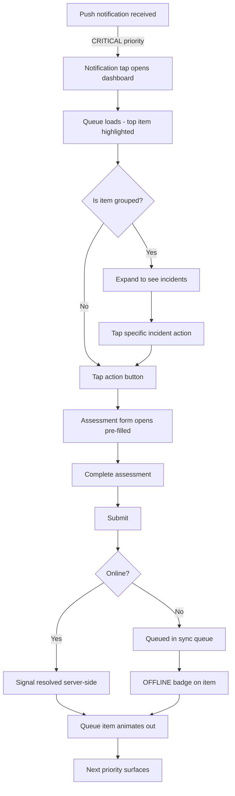
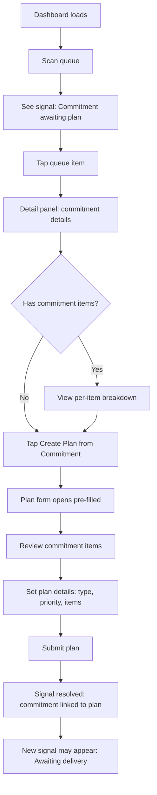
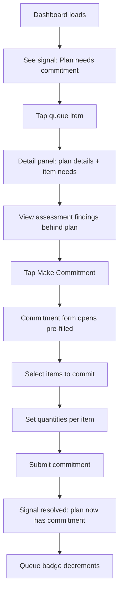
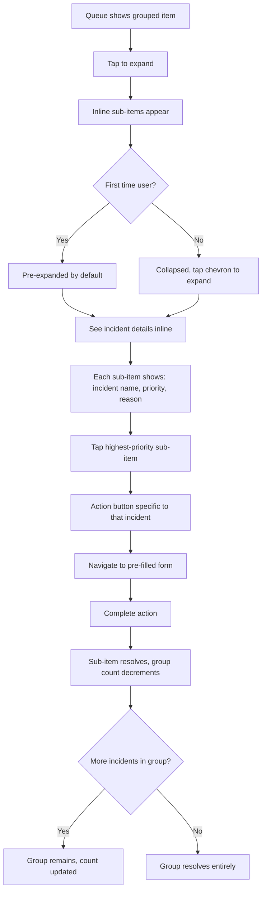
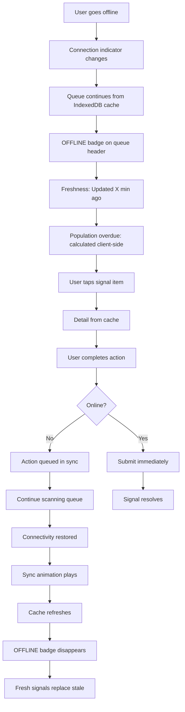
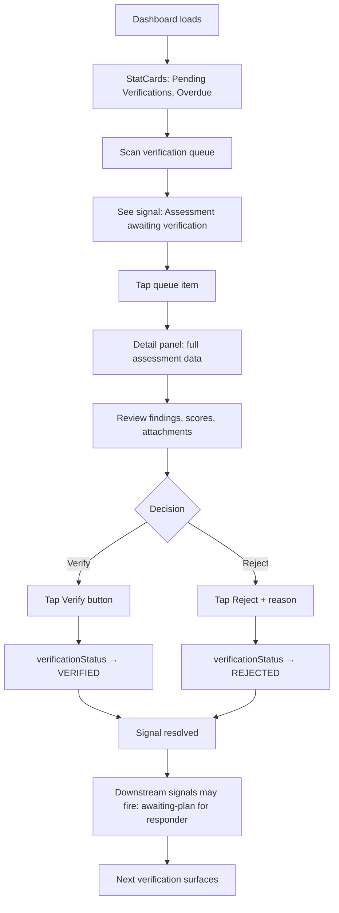

# UX Design Specification — Action-Driven Dashboards

**Author:** Bilnigma
**Date:** 2026-05-29

---

## Executive Summary

### Project Vision

Transform three passive DRMS role dashboards (Assessor, Responder, Donor) into mission-control surfaces driven by real system events. Each dashboard surfaces an action queue of deterministic signals — what needs doing right now — paired with an interactive map showing only the user's assigned entities. The result: every user knows exactly what to do next, without cross-referencing status lists manually.

This is a brownfield UX redesign extending an existing Next.js 14 PWA with Shadcn/ui, React-Leaflet maps, and Dexie offline storage. The design must feel native to the existing system while introducing novel interaction patterns (multi-incident signal grouping, bidirectional map↔queue selection, offline signal awareness).

### Target Users

**Assessor (field worker)** — Deployed to affected areas, mobile-first, often offline. Conducts 6 assessment types (Health, WASH, Shelter, Food, Security, Population). Needs instant clarity on what to assess next. Works under time pressure. May receive push notifications triggering reassessment.

**Responder (field/logistics)** — Mobile-first, sometimes offline. Plans and delivers responses based on verified assessments. Needs visibility into assessments awaiting plans, commitments awaiting matching plans, and plans awaiting delivery confirmation. Works across multiple entities simultaneously.

**Donor (resource provider)** — Desktop primary, mobile when on the move. Individual, organization, government, NGO, or corporate entity. Periodic user — signals must be clear and actionable on arrival. Needs to see what resources are needed and track commitment fulfillment.

**Coordinator (supervisor)** — Desktop primary, mobile when on the move. Sets population assessment cadence per incident, manages entity assignments, verifies submissions. Not the primary audience for dashboard redesign, but provides cadence configuration input that drives assessor signals.

### Key Design Challenges

1. **Information density vs. mobile usability** — Assessors and Responders are mobile-first and often offline. Up to 6 assessment types per entity, potentially across multiple incidents, must be scannable on small screens with fat touch targets. Multi-incident grouping collapses this, but the expand interaction must be effortless.

2. **Priority-at-a-glance across surfaces** — 4 priority levels must be instantly distinguishable in the queue, on map markers, and in push notifications — using more than color alone (accessibility). Map markers must convey priority at any zoom level.

3. **Bidirectional map↔queue selection** — Tapping a queue item pans the map; tapping a map marker filters the queue. This cross-surface sync must work on mobile (where map and queue are stacked) and desktop (where they're side-by-side) without disorienting the user.

4. **Offline signal awareness** — Signals cached in IndexedDB must feel current, not stale. Client-side overdue calculation with [OFFLINE] badge must be clearly communicated without causing panic or being ignored.

5. **Multi-incident grouping as a novel pattern** — Collapsing signals by entity+type into a single expandable queue item is new to this system. The interaction must be discoverable and intuitive — users shouldn't miss per-incident detail.

### Design Opportunities

1. **Mission-control paradigm** — Move beyond list views to a spatial, event-driven interface where the map and queue form a unified command surface. The queue is the to-do list; the map is the situational context. Together they answer "what" and "where."

2. **Offline-first action awareness** — Client-side overdue calculation with visual [OFFLINE] indicators creates a UX differentiator: the dashboard stays actionable even disconnected. This is rare in disaster management tools and a genuine advantage for field workers.

3. **Existing design system leverage** — 15 Shadcn/ui components, established color palette (success/warning/danger/info/offline), responsive breakpoints, WCAG 2.1 AA compliance, and role-specific navigation already exist. The design can focus on novel interaction patterns rather than rebuilding foundations.

## Core User Experience

### Defining Experience

The core interaction is **scan the action queue → understand priority → act in ≤ 2 taps/clicks**. Every user — Assessor, Responder, Donor — opens the dashboard with the same intent: "What do I need to do right now?" The action queue is the answer. If we nail the glance→understand→act loop, the dashboard succeeds.

The critical micro-interaction is the **multi-incident grouped queue item → expand → act** flow. A field assessor sees "Maiduguri Camp — Health assessment ▸ 2 incidents" and must instantly understand there are 2 reasons to act, tap to see both, tap one to start the assessment. This pattern is novel to the system — it must feel discoverable and intuitive, not hidden.

The action queue is the hero element. The map provides spatial context. Together they form a unified command surface where the queue answers "what" and the map answers "where."

### Platform Strategy

**Form factor breakdown:**

| Persona | Primary device | Input | Connectivity | Layout priority |
|---|---|---|---|---|
| Assessor | Mobile (phone) | Touch | Often offline | Queue above map, stacked |
| Responder | Mobile (phone) | Touch | Sometimes offline | Queue above map, stacked |
| Donor | Desktop | Mouse/keyboard | Usually online | Queue + map side-by-side |
| Coordinator | Desktop | Mouse/keyboard | Usually online | Not primary audience |

**Responsive strategy:**
- **Mobile (< 768px):** Queue is primary, full-width. Map accessible via toggle/tab below queue. Touch targets minimum 44px. Fat-finger-safe.
- **Tablet (768–1024px):** Queue and map share screen. Queue left (60%), map right (40%). Both visible simultaneously.
- **Desktop (> 1024px):** Queue left (40%), map right (60%). Detail panel slides in from right on item selection.

**Offline strategy:**
- Queue reads from IndexedDB cache. Signals remain visible with [OFFLINE] badge.
- Population overdue calculated client-side from cached cadence + last assessment date.
- Map renders cached entity markers. Tile fallback to static if offline tiles unavailable.
- On reconnect: seamless cache refresh, [OFFLINE] badges disappear, no page reload needed.

### Effortless Interactions

1. **Dashboard load = instant relevance.** No onboarding, no filter setup, no preferences. The queue shows prioritized signals for the user's role and assigned entities immediately. First-time and hundredth-time experience are identical.

2. **Queue→action in ≤ 2 taps.** Tap queue item → tap action button ("Start Assessment", "Create Plan", "Make Commitment"). The form opens pre-populated with entity, type, and incident context from the signal. Zero manual data entry for context the system already knows.

3. **Map↔queue sync happens automatically.** Tapping a queue item pans and highlights the map marker. Tapping a map marker filters the queue. No toggle, no mode switch. Both surfaces respond to each other continuously.

4. **Signal resolution is visible progress.** Submitting an assessment or creating a plan causes the queue item to animate out and the next priority to surface. The shrinking queue IS the feedback. No toast confirmation needed for the removal (though toast for the submission itself follows existing patterns).

5. **Group expand is one tap.** Tapping a grouped queue item (entity+type with multiple incidents) expands inline to show per-incident detail lines. No modal, no navigation. Tapping an expanded incident line navigates to the action form scoped to that incident.

### Critical Success Moments

1. **First dashboard load** — User sees a populated, prioritized queue (not empty state, not loading spinner). They know their top priority within 2 seconds. If the user's assigned entities have pending signals, the queue has items. If not, the empty state says "All clear — no pending actions" with a clear explanation.

2. **Queue→action transition** — Tapping "Start Assessment" lands the user on the assessment form with entity, type, and incident pre-filled. The user starts entering data immediately, not selecting context. This is the moment the system proves it understands the user's workflow.

3. **Offline resilience** — Field worker loses connectivity, opens dashboard, still sees their action queue with [OFFLINE] badges on each item. No error screen, no "connect to internet" modal. The cached signals are presented with the same visual priority as online signals. The system feels reliable under pressure.

4. **Signal resolution** — After the user acts (submits assessment, creates plan, makes commitment), the queue item animates out and the next-highest-priority item takes its place. The user sees tangible progress without switching views or checking a status page.

5. **Multi-incident discovery** — User sees a grouped item showing "▸ 2 incidents", taps it, sees both incident detail lines, and realizes a single entity has issues across two active incidents. This moment of spatial/temporal awareness is unique to the action-driven dashboard.

### Experience Principles

1. **Signal-first, not data-first.** The queue is the hero. Users never browse records to know what to do. Every pixel answers "what needs my attention?" The passive list view is dead; the action queue replaces it.

2. **Zero-config relevance.** The dashboard shows only what matters for the user's role and assignments. No filters to set, no preferences to configure. Signals appear because they matter, ordered by priority because urgency varies.

3. **Spatial context at a glance.** The map is always accessible (toggle on mobile, visible on desktop). Users build geographic intuition about their workload without actively studying the map. Marker colors = priority; marker count badges = signal density.

4. **Progress feels tangible.** Acting on a signal visibly removes it and surfaces the next. The queue shrinking is the reward. No completion ceremony, no confetti — just a cleaner queue.

5. **Offline is not an error state.** The dashboard works with cached signals. Offline indicators are informative, not alarming. The system trusts the user to act on last-known information and reconciles on reconnect.

## Desired Emotional Response

### Primary Emotional Goals

**Calm effectiveness.** The user feels competent and in control of their disaster response workload. The dashboard is a reliable co-pilot, not a fire alarm.

This means:
- **In control** — "I know exactly what needs my attention right now. Nothing is slipping through the cracks."
- **Confident** — "The system is telling me the right things. I trust the priorities."
- **Effective** — "I acted on a signal and it mattered. My work is making a difference."

### Emotional Journey Mapping

| Stage | Desired Feeling | Feeling to Avoid |
|---|---|---|
| Dashboard load | **Clarity** — instant understanding of workload | Overwhelm (too many signals), emptiness (no signals = am I useless?) |
| Scanning the queue | **Oriented** — clear priority hierarchy | Confusion (why is this first?), anxiety (too many CRITICAL items, no way to triage) |
| Acting on a signal | **Focused** — form is pre-filled, I just do my job | Frustration (manual context entry), doubt (is this the right entity/incident?) |
| Queue item resolves | **Accomplishment** — visible progress, queue shrinks | Ambiguity (did it work? is it still showing?) |
| Going offline | **Reassured** — cached signals still visible, system works | Panic (error screen), helplessness (can't do anything) |
| Receiving push notification | **Alert but not alarmed** — actionable information, clear next step | Alarm fatigue (too many notifications), noise (irrelevant signals) |

### Micro-Emotions

1. **Confidence > Confusion** — Every signal has a clear reason, a clear priority, and a clear action. No mystery items in the queue. The user never wonders "why is this here?"

2. **Trust > Skepticism** — Priority derivation is deterministic and explainable. If the user taps a CRITICAL signal, the detail panel shows the derivation (e.g., "Incident severity: CRITICAL"). The system earns trust by being transparent.

3. **Calm > Anxiety** — The queue is ordered and finite. It is not an infinite feed. Working through it feels manageable because each item is discrete and actionable. Grouping reduces visual noise.

4. **Accomplishment > Frustration** — Signal resolution is immediate and visible. The queue count badge in the navigation bar decreases. The queue visibly shrinks. The reward is seeing progress, not a congratulations screen.

### Design Implications

**Clarity → Layout decisions:**
- One priority per queue item, no mixed-priority items
- Highest priority always at the top
- No pagination — scroll the full list to see everything
- Queue count badge visible in navigation at all times

**Confidence → Information design:**
- Signal reason badges use clear text labels, not just icons: "Reassessment needed — verified Health response delivered"
- Priority badge shows both color and text: "CRITICAL" label, not just a red dot
- Detail panel explains the derivation: incident severity, assessment priority, or plan priority

**Calm → Visual treatment:**
- CRITICAL signals use red accent + pulsing shape indicator + "CRITICAL" text label — not just a wall of red
- Grouped items reduce visual noise: one card instead of three separate items
- Offline badge uses informative gray-blue, not alarming red: "OFFLINE" badge, not "DISCONNECTED"
- Cache freshness indicator: "Updated 12 min ago", not "DATA MAY BE STALE"

**Accomplishment → Animation and feedback:**
- Resolved items animate out of the queue (slide + fade)
- Navigation badge count decrements visibly
- Empty state is a positive moment: "All clear — no pending actions" with a brief explanation of what the system is monitoring

**Alert-not-alarmed → Push notification design:**
- Push only for CRITICAL and HIGH priority signals
- Each notification includes: entity name, specific signal reason, and the action to take
- Example: "Assessment needed: Maiduguri Camp — Health assessment not yet conducted" (not "You have 3 new signals")

### Emotional Design Principles

1. **Be a co-pilot, not a fire alarm.** The dashboard informs and guides. It does not scream. Even CRITICAL signals are presented as actionable tasks, not emergencies.

2. **Transparency builds trust.** Every signal has a visible reason and a traceable priority derivation. The user can understand why something is ranked the way it is.

3. **Finite beats infinite.** The queue is a bounded list of actionable items, not an endless feed. Grouping reduces count without hiding information. The user can see the end of their workload.

4. **Offline is calm competence.** Cached signals with clear offline indicators say "here's what we last knew" — not "something is wrong." The system projects reliability even without connectivity.

5. **Progress is quiet but visible.** No confetti, no celebration. Just a shrinking queue and a decreasing badge count. The satisfaction is in doing the work, not in the system praising you for it.

## UX Pattern Analysis & Inspiration

### Inspiring Products Analysis

**Todoist — Priority-based task queue**
- **What it does well:** Priority markers (p1–p4) with clear visual hierarchy. Inbox as the default view — everything arrives ordered by priority. Completing a task removes it instantly and the next item surfaces.
- **Transferable pattern:** The priority queue as the default landing view. No navigation needed to find your next task. CRITICAL/HIGH/MEDIUM/LOW maps directly to p1–p4.
- **What doesn't transfer:** Todoist relies on user-created tasks. Our queue is system-generated. The user can't delete signals — only act on them. We need to show *why* each item exists (signal reason).

**Google Maps — Spatial + actionable overlays**
- **What it does well:** Markers convey information at a glance (color = status, icon = type, number badge = count). Tapping a marker shows a bottom sheet with detail + action buttons. The map responds to every interaction.
- **Transferable pattern:** Map markers with count badges showing signal density per entity. Color coding by highest-priority signal. Bottom sheet (mobile) or side panel (desktop) for entity detail on marker tap.
- **What doesn't transfer:** Google Maps shows everything; we show only assigned entities. Our map is filtered by default, not a browsing surface.

**WhatsApp — Offline queue feels native**
- **What it does well:** Messages composed offline show a pending clock icon. When sent, the clock becomes a check. No error modal, no "connect to internet" prompt. The offline state is transparent and calm.
- **Transferable pattern:** Cached signals show an [OFFLINE] badge that feels informative, not alarming. On reconnect, the badge disappears and fresh signals replace stale ones — no page reload, no manual refresh.
- **What doesn't transfer:** WhatsApp is chat; we're a dashboard. The pattern transfers at the micro-level (offline indicator, sync animation) but not the interaction model.

**Trello — Card-based queue with expand**
- **What it does well:** Cards show summary info. Click/tap to expand for full detail. Labels and badges on cards convey status at a glance. Drag to reorder (we don't need this — system orders by priority).
- **Transferable pattern:** Queue items as cards with: entity name, type badge, signal reason, priority indicator, action button. Tapping expands grouped items to show per-incident detail lines.
- **What doesn't transfer:** Trello is user-organized; our queue is system-ordered. No drag-and-drop. No user-defined columns.

**Linear — Notification inbox with grouping**
- **What it does well:** Notifications grouped by type. Each item has a direct action link. Read/unread state with bulk actions. Clean, dense information layout that doesn't feel overwhelming.
- **Transferable pattern:** Grouped signal items with expand/collapse. Each incident line is a direct link to the action form. Unread notifications in the nav badge.
- **What doesn't transfer:** Linear targets developers; we target field workers. Our information density must be lower, touch targets larger, text more prominent.

### Transferable UX Patterns

**Navigation Patterns:**

1. **Queue-first landing** (from Todoist) — The action queue IS the dashboard. No overview tabs, no summary cards before the queue. Users land on their prioritized task list immediately.

2. **Bottom sheet for detail** (from Google Maps) — On mobile, selecting a queue item or map marker slides up a bottom sheet with entity detail and action buttons. On desktop, a right-side detail panel slides in.

**Interaction Patterns:**

1. **Inline expand for grouping** (from Linear/Trello) — Grouped queue items expand inline to show per-incident detail lines. No modal, no navigation away from the queue. One tap to expand, one tap on a detail line to navigate to the action form.

2. **Two-tap action flow** (from Todoist) — Tap queue item to select/highlight → tap action button to navigate to pre-filled form. The action button is always visible on the selected item, not hidden behind a long-press or swipe.

3. **Bidirectional cross-surface sync** (from Google Maps) — Tapping queue item pans map and highlights marker. Tapping map marker filters queue and scrolls to the item. Both interactions are continuous, not modal.

**Visual Patterns:**

1. **Priority as shape + color + label** (from Todoist/Linear) — CRITICAL = red + pulsing dot + "CRITICAL" text. HIGH = orange + solid dot + "HIGH" text. MEDIUM = yellow + dot. LOW = gray + dot. Never color alone.

2. **Calm offline indicators** (from WhatsApp) — Gray-blue [OFFLINE] badge on cached signals. "Updated X min ago" freshness timestamp. Sync animation when reconnecting. No red error banners.

3. **Queue count badge in navigation** (from Linear/GitHub) — Persistent badge showing total active signal count. Decrements on resolution. Provides ambient awareness of workload without opening the dashboard.

### Anti-Patterns to Avoid

1. **Infinite scroll / endless feed** — The queue must feel finite and manageable. Show total count ("3 of 7 actions viewed"). Don't hide the total behind endless scroll.

2. **Empty state as blank page** — If no signals exist, the empty state must be positive and informative: "All clear — no pending actions for your assigned entities." Not a blank white screen.

3. **Alarm-red offline banner** — A bright red "YOU ARE OFFLINE" banner across the top creates panic. Use a subtle gray-blue indicator instead. The user knows they're offline — help them, don't alarm them.

4. **Notification spam** — Don't push-notify for every signal. Only CRITICAL and HIGH. Don't batch-notify ("You have 5 new signals"). Each notification must be specific and actionable.

5. **Map as the primary surface on mobile** — On mobile, the queue is primary. The map is a toggle/tab below. Forcing users to interact with the map first on mobile wastes their time. They want to know WHAT to do, then WHERE it is.

6. **Swipe-to-action on mobile** — Swipe gestures are error-prone on small screens and undiscoverable. Use explicit action buttons instead.

7. **Modal detail views** — Don't open a full-screen modal when the user taps a queue item. Expand inline or slide a panel. The user should always see the queue context.

### Design Inspiration Strategy

**What to Adopt:**
- Queue-first landing view (Todoist) — supports the core experience of instant relevance
- Priority as shape + color + label (Todoist/Linear) — supports accessibility and calm effectiveness
- Calm offline indicators (WhatsApp) — supports offline resilience and reassurance
- Queue count badge in navigation (Linear) — supports ambient workload awareness

**What to Adapt:**
- Google Maps bottom sheet → mobile detail panel for our queue items (entity detail + action buttons on signal selection)
- Linear notification grouping → multi-incident signal grouping (expand/collapse inline instead of separate pages)
- Trello card layout → queue item cards with summary info + action button (simpler, fewer metadata fields, larger touch targets)

**What to Avoid:**
- Chat-style interfaces (WhatsApp conversation model doesn't fit a dashboard)
- Drag-and-drop reordering (system orders by priority, user doesn't control order)
- Social features / activity feeds (signals are personal tasks, not shared timelines)
- Gamification elements (badges, streaks, leaderboards — inappropriate for disaster response)

## Design System Foundation

### Design System Choice

**Existing foundation (brownfield): Shadcn/ui + Tailwind CSS + Radix UI**

This project extends an established design system already in production. No design system selection is needed. The existing foundation provides:

- **Component library:** 15 custom DMS components built on Shadcn/ui (DashboardCard, StatusBadge, ConnectionIndicator, VerificationQueue, GapAnalysisIndicator, RoleSwitcher, QuickActions, EntityCard, SyncQueueItem, DataTable, EmptyState, ProgressIndicator, NotificationToast, FormField, Button)
- **Styling:** Tailwind CSS 3.x with CSS custom properties for semantic theming
- **Accessibility:** WCAG 2.1 AA compliance built into all components via Radix UI primitives
- **Design tokens:** Semantic colors (--success, --warning, --danger, --info, --offline), role colors (--role-assessor, --role-coordinator, --role-responder, --role-donor, --role-admin), gap analysis colors, typography scale (6 sizes), spacing scale (6 sizes)
- **Responsive breakpoints:** Mobile-first — sm:640px, md:768px, lg:1024px, xl:1280px
- **State management patterns:** Zustand (UI state), TanStack Query (server state), Dexie (offline)
- **Navigation system:** Role-specific sidebar with NavItem components, breadcrumb header, role switcher

### Rationale for Selection

Shadcn/ui was chosen for the original project because:
1. **Copy-paste ownership** — Components live in the project, not in a dependency. Full control for disaster-response-specific customization.
2. **Radix UI primitives** — Accessibility built in at the primitive level, critical for field workers who may use screen readers or keyboard navigation.
3. **Tailwind CSS integration** — Utility-first styling aligns with the project's need for rapid, responsive iteration.
4. **No runtime overhead** — Unlike styled-components or emotion, Tailwind generates only used CSS.
5. **Established patterns** — The team already knows the conventions. New dashboard components follow the same patterns.

### Implementation Approach

**New components to build (extending the existing library):**

| Component | Purpose | Pattern Source |
|---|---|---|
| `ActionQueue` | Shared queue component parameterized by role | New — queue container with sort controls |
| `ActionQueueItem` | Single queue item with expand, priority, reason, action | Trello card + Todoist task item |
| `SignalReasonIcon` | Lucide icon mapping for 11 signal reasons | Extends existing StatusBadge pattern |
| `SignalDetailPanel` | Expanded detail (bottom sheet mobile, side panel desktop) | Google Maps bottom sheet pattern |
| `PerItemCoverage` | Item-level coverage breakdown for plans | Extends existing GapAnalysisIndicator |
| `NotificationBadge` | Unread signal count for nav bar | Extends existing badge pattern |
| `NotificationToast` | In-app toast for signal events | Extends existing NotificationToast |

**Modified existing components:**
- `Navigation.tsx` — Add NotificationBadge with signal count
- `DashboardCard` — Reuse for queue summary stats if needed (optional)
- `ConnectionIndicator` — May need to show signal cache freshness

**All new components follow existing conventions:**
- TypeScript interfaces for all props
- `cn()` utility for conditional Tailwind classes
- Radix UI primitives for accessibility (Dialog, Popover, Tooltip)
- `useForm` + Zod for any form interactions
- TanStack Query for data fetching hooks

### Customization Strategy

**Priority colors reuse existing severity tokens (no new CSS properties needed):**

Priority levels map directly to existing HSL severity tokens that already have light + dark mode variants in `globals.css`:
- CRITICAL → `--severity-critical`
- HIGH → `--severity-high`
- MEDIUM → `--severity-warning`
- LOW → `--severity-neutral`

**Signal reason → HugeIcons mapping (via `src/lib/icons.tsx` wrapper):**

| Signal Reason | Wrapper Alias | Color Source |
|---|---|---|
| unassessed | `ClipboardList` | Incident severity |
| reassessment-needed | `RefreshCw` | Assessment priority |
| overdue | `Clock` | Always CRITICAL (red) |
| awaiting-plan | `FileText` | Assessment priority |
| awaiting-plan-for-commitment | `Link` | Incident severity |
| awaiting-delivery | `Truck` | Plan priority |
| partially-covered | `PieChart` | Plan priority |
| assessment-needs-response | `AlertCircle` | Assessment priority |
| plan-needs-commitment | `DollarSign` | Plan priority |
| partially-fulfilled | `Package` | Incident severity |
| commitment-awaiting-plan | `Timer` | Incident severity |

All icons rendered at `size={22}` (HugeIcons needs 1-2 sizes larger than Lucide for equivalent visual weight).

**Priority visual system (shape + color + text):**

| Priority | Shape | Token | Text Label | Animation |
|---|---|---|---|---|
| CRITICAL | Pulsing dot | `--severity-critical` | "CRITICAL" | Gentle pulse (1.5s cycle) |
| HIGH | Solid dot | `--severity-high` | "HIGH" | None |
| MEDIUM | Solid dot | `--severity-warning` | "MEDIUM" | None |
| LOW | Solid dot | `--severity-neutral` | "LOW" | None |

**Offline visual treatment:**
- Badge: Gray-blue background (#e0e7ff), text "OFFLINE", no red
- Freshness: "Updated X min ago" below queue header in muted text
- Sync animation: Existing ConnectionIndicator spinning pattern
- No error banners, no "DISCONNECTED" text

## Defining Core Experience

### Defining Experience

**"Open dashboard → see what to do → tap → done."**

The defining interaction is the **glance→tap→act loop** on the action queue. Every other element — map, notifications, grouping, offline cache — exists to support this loop. If we nail this, everything else follows.

The queue is the hero surface. The map is supporting context. Notifications are the pull-back-in mechanism. All three converge on the same loop: see a signal, understand it, act on it.

This applies uniformly across all three roles:
- **Assessor:** See unassessed entity → tap → start assessment
- **Responder:** See commitment without plan → tap → create plan
- **Donor:** See plan needing commitment → tap → make commitment

### User Mental Model

**Current mental model (what users do today):**
Users think in terms of "my entities" and "what's pending." They mentally cross-reference: "I was assigned Maiduguri Camp — did I do the Health assessment? What about WASH? Wasn't there a response delivered last week that means I need to reassess?" This mental load is exactly what the dashboard eliminates.

**New mental model (what the dashboard enables):**
The shift is from "what entities do I have and what's their status?" to "what does the system need me to do right now?" The system does the cross-referencing across entities, types, incidents, and deadlines. The user just acts on the top item.

**Donor mental model difference:**
Donors think less frequently: "Where are my commitments needed?" They don't track entity assignments closely. The dashboard must answer this without the donor needing to study the map or browse plans. Donor signals are more informational ("your commitment is partially fulfilled") and less immediately actionable ("go do a field assessment").

**Where users might get confused:**
- Grouped signals ("▸ 2 incidents") — users might not realize there's more detail inside. The expand affordance must be visually obvious.
- Signal reason text — "Reassessment needed" needs a brief explanation of WHY ("verified Health response delivered"). Without the why, the signal feels arbitrary.
- Empty queue — users might think the system is broken, not that they're caught up. The empty state must be explicitly positive.

### Success Criteria

**"This just works" indicators:**
1. User opens dashboard and sees their top priority within 2 seconds — no scrolling, no tab switching
2. User can act on any signal in exactly 2 taps (tap item → tap action button)
3. Action form opens pre-populated with entity, type, and incident context — user starts entering data immediately
4. After acting, the queue visibly updates — the item disappears and the next surfaces

**Success indicators (measurable):**
- **SM-3:** >70% of signals result in a click-through within 24 hours (engagement)
- **SM-4:** >80% of orphan commitments linked to a plan within 48 hours (conversion)
- **Qualitative:** Users describe the dashboard as "telling me what to do" rather than "showing me data"

**Automatic behaviors (no user action needed):**
- Queue auto-sorts by priority on every data refresh (30s polling)
- Map auto-highlights when queue item is selected
- Queue auto-filters when map marker is tapped
- Offline cache auto-populates on login
- Signal resolution auto-happens when underlying condition changes (no dismiss button needed)

### Novel UX Patterns

**Established patterns (adopt as-is):**
- Priority-sorted task queue (Todoist, Linear)
- Map markers with count badges (Google Maps)
- Expand/collapse inline grouping (Linear notifications)
- Offline cache with pending indicators (WhatsApp)
- Bottom sheet for mobile detail (Google Maps)

**Novel combination (new to disaster management):**
These patterns haven't been combined in a disaster management context with:
- System-generated (not user-created) tasks — the user doesn't add items to the queue; the system does
- Deterministic priority from external data — priority isn't user-set; it's derived from incident severity, assessment priority, or plan priority
- Role-scoped visibility — each user sees only signals for their role and assigned entities

**Novel element — multi-incident grouping:**
One queue item per entity+type, expandable to show per-incident detail lines. No direct precedent in mainstream consumer apps. The closest analog is grouped email threads (Gmail) or grouped notifications (Linear), but applied to actionable tasks across multiple disaster incidents.

**Teaching the pattern:**
- First time: grouped items show with expanded state by default (first time only)
- Subsequent: collapsed with "▸ N incidents" affordance
- The chevron/expansion indicator must be large enough to tap on mobile (≥44px touch target)

### Experience Mechanics

**The glance→tap→act loop, step by step:**

**1. Initiation — Dashboard opens:**
- Queue loads from TanStack Query cache (instant for returning users) or IndexedDB (offline)
- No loading spinner for cached data — skeleton only on first-ever load
- First queue item is visible without scrolling
- Queue count badge in navigation updates immediately
- If empty: "All clear — no pending actions for your assigned entities" with monitoring explanation

**2. Scanning — User surveys the queue:**
- Items ordered by priority (CRITICAL → HIGH → MEDIUM → LOW), then by created date within priority
- Each item shows: entity name, type badge, signal reason (icon + text), priority indicator (shape + color + label), created time
- Grouped items show: entity name, type badge, "▸ N incidents" with highest priority indicator
- Sort control (dropdown) in queue header: Priority (default) | Type
- Total signal count shown in header: "5 actions pending"

**3. Selection — User taps a queue item:**
- Item visually highlights (selected state: blue left border, light blue background)
- Map pans to entity and marker pulses (if entity has coordinates)
- On mobile: bottom sheet slides up with expanded detail
- On desktop: right-side detail panel slides in
- Detail shows: full signal reason explanation, linked data (assessment findings, commitment items, plan status), action button
- For grouped items: tapping expands inline to show per-incident detail lines, each with its own action button

**4. Action — User taps action button:**
- "Start Assessment" → navigates to assessment form pre-filled with entityId, type, incidentId
- "Create Plan" → navigates to response planning form pre-filled with assessment data
- "Create Plan from Commitment" → navigates to commitment import form pre-filled with commitment data
- "Make Commitment" → navigates to commitment form pre-filled with entity and plan items
- "Confirm Delivery" → navigates to delivery confirmation form
- "View Assessment" / "View Commitment" → opens read-only detail view
- Navigation is instant (Next.js client-side routing with form pre-population)

**5. Resolution — User completes action and returns:**
- Signal is resolved server-side (within the service method's transaction)
- On dashboard return: resolved item animates out (slide left + fade, 300ms)
- Next-highest-priority item surfaces into view
- Navigation badge count decrements
- Map marker updates (signal count/priority may change for that entity)
- If queue becomes empty: transition to "All clear" empty state

**6. Map interaction (secondary, supporting):**
- User taps a map marker → queue filters to show only signals for that entity → queue scrolls to first matching item
- User taps map background / "clear filter" button → queue filter clears, all signals visible
- Map markers show: entity name label, count badge (signal count), color ring (highest priority)
- Entities with no pending signals: gray markers, lower opacity
- Only assigned entities shown — no unassigned entities on map

## Visual Design Foundation

### Color System

**Existing foundation (HSL custom properties with dark mode):**

The project uses HSL CSS custom properties in `globals.css` with separate `:root` (light) and `.dark` (dark) values. All colors are defined as `H S% L%` triplets consumed via `hsl(var(--token))`. This means no hardcoded hex values anywhere — every color adapts to the active theme.

**Existing semantic tokens (both themes defined):**

| Token | Light | Dark |
|---|---|---|
| `--background` | `0 0% 100%` | `224 71% 4%` |
| `--foreground` | `222.2 84% 4.9%` | `213 31% 91%` |
| `--destructive` | `0 84.2% 60.2%` | `0 63% 31%` |
| `--severity-critical` | `0 72.2% 50.6%` | `0 72.2% 50.6%` |
| `--severity-high` | `24.6 95% 53.1%` | `20.5 90.2% 48.2%` |
| `--severity-medium` | `47.9 95.2% 53.1%` | `48 96.5% 53.7%` |
| `--severity-low` | `142.1 76.2% 36.3%` | `142.1 70.6% 45.3%` |
| `--severity-info` | `217.2 91.2% 59.8%` | `217.2 80.6% 66.7%` |
| `--severity-success` | `160 84.1% 39.4%` | `160 70.1% 53.3%` |
| `--severity-warning` | `37.7 92.1% 50.3%` | `38.9 85.3% 55.7%` |
| `--severity-neutral` | `220 8.9% 46.1%` | `220 8.9% 56.5%` |

**Priority color mapping (reusing existing severity tokens):**

New priority levels map directly to existing severity tokens. No new CSS custom properties needed:

| Priority | CSS Variable | Resolves to Light | Resolves to Dark |
|---|---|---|---|
| CRITICAL | `hsl(var(--severity-critical))` | `0 72.2% 50.6%` (red) | `0 72.2% 50.6%` (red) |
| HIGH | `hsl(var(--severity-high))` | `24.6 95% 53.1%` (orange) | `20.5 90.2% 48.2%` (adjusted orange) |
| MEDIUM | `hsl(var(--severity-warning))` | `37.7 92.1% 50.3%` (amber) | `38.9 85.3% 55.7%` (lighter amber for dark bg) |
| LOW | `hsl(var(--severity-neutral))` | `220 8.9% 46.1%` (gray) | `220 8.9% 56.5%` (lighter gray for dark bg) |

This is critical: the dark mode values are already tuned for contrast on dark backgrounds. Using these tokens ensures priority badges, queue item borders, and map markers are legible in both themes without any additional work.

**Priority visual system (shape + color + text):**

| Priority | Shape | Token | Text Label | Animation |
|---|---|---|---|---|
| CRITICAL | Pulsing dot | `--severity-critical` | "CRITICAL" | Gentle pulse (1.5s cycle) |
| HIGH | Solid dot | `--severity-high` | "HIGH" | None |
| MEDIUM | Solid dot | `--severity-warning` | "MEDIUM" | None |
| LOW | Solid dot | `--severity-neutral` | "LOW" | None |

**Offline visual treatment:**
- Badge: `bg-indigo-100 text-indigo-800 dark:bg-indigo-900 dark:text-indigo-200` — gray-blue in light, deeper indigo in dark
- Freshness: "Updated X min ago" in `text-muted-foreground` (already theme-aware)
- Sync animation: Existing ConnectionIndicator spinning pattern
- No error banners, no "DISCONNECTED" text

### Typography System

**Existing foundation (system font stack):**

```css
--font-sans: -apple-system, BlinkMacSystemFont, "Segoe UI", Roboto, sans-serif;
--font-mono: "SF Mono", Monaco, "Cascadia Code", monospace;
```

No changes needed. The system font stack is optimized for performance (no font downloads) and native feel across platforms. Critical for field workers on slow connections.

**Existing type scale:**

| Size | Value | Usage in dashboard |
|---|---|---|
| xs | 0.75rem | Timestamps, cache freshness |
| sm | 0.875rem | Signal reason text, incident detail lines |
| base | 1rem | Entity names, queue item body text |
| lg | 1.125rem | Queue header, section headings |
| xl | 1.25rem | Action button labels |
| 2xl | 1.5rem | Dashboard title |

**Type sizing for HugeIcons:**
- Queue item icons (signal reason): rendered at `size={22}` (HugeIcons needs 1-2 sizes larger than Lucide's default 16–18 for equivalent visual weight)
- Priority dots: rendered via CSS (no icon needed)
- Action button icons: `size={20}`
- Map marker icons: rendered via Leaflet DivIcon CSS (no HugeIcons dependency)

### Icon System

**HugeIcons via wrapper (`src/lib/icons.tsx`):**

The project uses `@hugeicons/react` with `@hugeicons/core-free-icons`. All icons are wrapped in `src/lib/icons.tsx` with Lucide-compatible names for consistent imports. HugeIcons have thinner strokes than Lucide, so sizes are 1-2 levels larger.

**Signal reason icon mapping (all icons already in wrapper):**

| Signal Reason | Wrapper Alias | HugeIcons Source | Size |
|---|---|---|---|
| unassessed | `ClipboardList` | ClipboardIcon | 22 |
| reassessment-needed | `RefreshCw` | ReloadIcon | 22 |
| overdue | `Clock` | Clock01Icon | 22 |
| awaiting-plan | `FileText` | File01Icon | 22 |
| awaiting-plan-for-commitment | `Link` | Link01Icon | 22 |
| awaiting-delivery | `Truck` | DeliveryTruck01Icon | 22 |
| partially-covered | `PieChart` | PieChart01Icon | 22 |
| assessment-needs-response | `AlertCircle` | AlertCircleIcon | 22 |
| plan-needs-commitment | `DollarSign` | Dollar01Icon | 22 |
| partially-fulfilled | `Package` | Package01Icon | 22 |
| commitment-awaiting-plan | `Timer` | Timer01Icon | 22 |

No new icon imports needed. All 11 signal reason icons already exist in the wrapper. New signal components import from `@/lib/icons` as usual.

### Spacing & Layout Foundation

**Existing spacing scale (no changes needed):**

| Token | Value | Usage |
|---|---|---|
| space-1 | 0.25rem | Inline icon gaps |
| space-2 | 0.5rem | Badge padding, tight spacing |
| space-3 | 0.75rem | Queue item internal gaps |
| space-4 | 1rem | Queue item padding, section gaps |
| space-6 | 1.5rem | Queue header padding |
| space-8 | 2rem | Dashboard section spacing |

**Dashboard layout proportions (new):**

| Viewport | Queue | Map | Detail |
|---|---|---|---|
| Mobile (<768px) | 100% full-width | Toggle/tab below | Bottom sheet overlay |
| Tablet (768–1024px) | 60% left | 40% right | Inline expand |
| Desktop (>1024px) | 40% left | 60% right | Right panel slide-in |

**Queue item dimensions (touch-optimized):**
- Item height: minimum 72px (comfortable touch target)
- Action button: 44px × 44px minimum
- Expand chevron: 44px × 44px touch target
- Priority badge: 24px × 24px visual, 44px tap area via padding
- Inline spacing between items: 2px (tight list, separated by border-bottom)

### Accessibility Considerations

**Existing WCAG 2.1 AA compliance (maintained):**
- Color contrast minimum 4.5:1 for normal text in both light and dark themes
- Priority indicators: shape + color + text label (never color alone)
- Focus indicators on all interactive elements (Radix UI primitives)
- Keyboard navigation: Tab through queue items, Enter to select, Escape to close detail panel
- Screen reader announcements for queue changes (ARIA live region)
- Touch targets minimum 44px for all interactive elements

**Dashboard-specific accessibility:**
- Queue count badge: `aria-label="5 pending actions"` on nav badge
- Signal priority: `aria-label="CRITICAL priority"` on priority indicator
- Grouped items: `aria-expanded` state on expand/collapse
- Map markers: `aria-label="Maiduguri Camp, 3 signals, CRITICAL priority"`
- Offline badge: `aria-label="Offline, last updated 12 minutes ago"`
- Empty state: `role="status"` with descriptive text

## Design Direction Decision

### Design Directions Explored

Six design direction mockups were generated in `_bmad-output/planning-artifacts/ux-design-directions.html`:

1. **Command Center** (Desktop 1280px+) — Queue 45% / Map 55%. Tall cards with priority left border.
2. **Compact Feed** (Mobile 375px+) — Full-width queue, compact rows, map as bottom toggle.
3. **Split Panel** (Tablet 768px+) — Queue 55% / Map 45%, slide-in detail panel.
4. **Map-First Spatial** (Desktop 1440px+) — Map 65% / Queue 35%, floating detail cards.
5. **Card Grid** (Alternative) — 2-column card grid, map as full-screen toggle.
6. **Timeline View** (Chronological) — Date dividers, timeline dots, small inset map.

### Chosen Direction: Responsive Progression (1 → 3 → 2)

The dashboard uses **three directions mapped to breakpoints**, not a single direction:

| Breakpoint | Direction | Layout |
|---|---|---|
| **Desktop (≥1024px)** | Direction 1 — Command Center | Queue 45% / Map 55%. Tall cards (80px+). Priority left border. Entity name prominent. Action button right-aligned. Grouped items expand as indented sub-cards. |
| **Tablet (768–1023px)** | Direction 3 — Split Panel | Queue 55% / Map 45%. Medium cards (72px). Icon left, text center, action right. Selected item slides detail panel in from right, overlaying map. |
| **Mobile (<768px)** | Direction 2 — Compact Feed | Queue 100% full-width. Compact rows (60px). Single-line items. Expand = detail strip below. Map accessible via bottom toggle panel. Optimized for thumb scrolling. |

**Navigation panel is handled by the existing AppShell** — the dashboard interior is agnostic:
- Desktop: Fixed left sidebar (264px), dashboard fills `calc(100vw - 264px)`
- Tablet/Mobile: Hidden sidebar (hamburger overlay), dashboard fills `100vw`
- Dashboard page uses `isDashboard={true}` for full-width content area without breadcrumbs

### Design Rationale

**Why this responsive progression works:**

1. **Progressive disclosure of spatial context** — Mobile users (field workers) need the queue first; they're in the field and already know WHERE they are. Desktop/tablet users benefit from simultaneous spatial awareness. The map grows proportionally as screen real estate increases.

2. **Touch-first on mobile, pointer-first on desktop** — Direction 2's compact single-line rows work for thumb scrolling. Direction 1's tall cards with right-aligned buttons work for mouse/trackpad. Direction 3 bridges both.

3. **Consistent mental model across breakpoints** — The queue is always on the left or top. The map is always on the right or below. Priority ordering never changes. Action button position adapts (right on desktop, inline on mobile) but behavior is identical.

4. **Detail panel adapts to viewport** — Desktop: right-side panel slides in. Tablet: detail overlays map area. Mobile: bottom sheet or inline expand. Same information, different surface.

### Implementation Approach

**Responsive layout using Tailwind breakpoints:**

```tsx
<div className="flex flex-col md:flex-row h-full">
  {/* Queue — always first in DOM */}
  <div className="w-full md:w-[55%] lg:w-[45%] shrink-0 overflow-y-auto">
    <ActionQueue />
  </div>
  
  {/* Map — secondary on mobile, visible on tablet+ */}
  <div className="hidden md:block md:w-[45%] lg:w-[55%] relative">
    <MapView />
    {/* Desktop detail panel overlay */}
    <SignalDetailPanel />
  </div>
  
  {/* Mobile map toggle */}
  <div className="md:hidden">
    <MapToggle />
  </div>
</div>
```

**Card height responsive classes:**
- Mobile: `min-h-[60px]` compact rows
- Tablet: `min-h-[72px]` medium cards  
- Desktop: `min-h-[80px]` tall cards with generous spacing

**Detail panel behavior:**
- Mobile: inline expand (Direction 2) or bottom sheet overlay
- Tablet: slides in from right, overlays map (Direction 3)
- Desktop: slides in from right, pushes map narrower (Direction 1)

## StatCards

All dashboards include a row of up to 4 StatCards **always visible at the top** of the dashboard, above the queue and map. They provide at-a-glance workload metrics before the user dives into the queue.

**Layout:**
- Desktop: 4 cards in a horizontal row (`grid-cols-4`)
- Tablet: 4 cards in a horizontal row (`grid-cols-4`, slightly smaller)
- Mobile: Horizontal scrollable row of 4 compact cards

**StatCards per role:**

| Role | Card 1 | Card 2 | Card 3 | Card 4 |
|---|---|---|---|---|
| **Assessor** | Pending Assessments (count) | Overdue (count) | Completed Today (count) | Entities Assigned (count) |
| **Responder** | Awaiting Plans (count) | Awaiting Delivery (count) | Completed Today (count) | Active Plans (count) |
| **Donor** | Plans Needing Commitment (count) | My Active Commitments (count) | Partially Fulfilled (count) | Fulfilled Today (count) |
| **Coordinator** | Pending Verifications (count) | Pending Deliveries (count) | Verified Today (count) | Overdue (count) |

**Each card shows:**
- Label (text-xs muted)
- Value (text-2xl font-bold)
- Severity color indicator (left border or icon color using severity tokens)
- Loading skeleton while fetching

**Implementation:** Extends the existing `StatCard` and `StatCardGrid` components already used in the Coordinator dashboard (`src/components/shared/StatCard.tsx` and `StatCardGrid.tsx`).

**Data source:** TanStack Query hook fetching from `/api/v1/signals/stats?role={role}` — aggregates signal counts by status and type. Refetches on the same 30s interval as the queue.

## User Journey Flows

### Journey 1: Assessor — Population Assessment Trigger

**Persona:** Assessor (field worker, mobile-first, often offline)
**Goal:** Receive push notification about overdue assessment, navigate to dashboard, act immediately
**Emotional arc:** Alert → Reassured → Focused → Accomplished



**Screen-by-screen:**
1. **Push notification:** "Assessment overdue: Maiduguri Camp — Population assessment overdue by 6h"
2. **Dashboard:** Queue loads from cache (instant). CRITICAL Maiduguri Camp signal at top with pulsing red dot. Map pans to entity.
3. **Tap "Start Assessment":** Form opens pre-filled: entityId, type=Population, incidentId. User enters data immediately.
4. **Submit:** Signal resolves. Queue item animates out. Next priority surfaces.

### Journey 2: Responder — Orphan Commitment Discovery

**Persona:** Responder (field/logistics, mobile-first, sometimes offline)
**Goal:** Discover a donor commitment with no matching plan, create a plan to fulfill it
**Emotional arc:** Discovery → Understanding → Action → Progress



**Screen-by-screen:**
1. **Queue:** Signal shows "Dikwa Camp — Security" with reason "Commitment awaiting plan".
2. **Detail panel:** Donor name, commitment items with quantities, delivery status. Action: "Create Plan from Commitment".
3. **Form:** Commitment import form pre-filled with commitment data. Responder sets plan type, priority, delivery date.
4. **Submit:** Plan created, PlanCommitment junction record created. Signal resolves.

### Journey 3: Donor — Matching Commitment to Plan

**Persona:** Donor (desktop primary, periodic user)
**Goal:** See what resources are needed, make a commitment to a plan
**Emotional arc:** Awareness → Evaluation → Contribution → Satisfaction



**Screen-by-screen:**
1. **Queue:** Signal shows "Bama Town — Food" with reason "Plan needs commitment".
2. **Detail panel:** Plan summary, assessment findings, item list with needed quantities.
3. **Form:** Commitment form with plan items pre-filled. Donor selects items and sets quantities.
4. **Submit:** Commitment created, PlanCommitment junction links it to plan. Signal resolves.

### Journey 4: Multi-Incident Signal Management

**Persona:** Any role
**Goal:** Handle a grouped signal spanning multiple incidents, act on each
**Emotional arc:** Scanning → Discovery → Prioritization → Sequential action



**Screen-by-screen:**
1. **Queue item:** "Maiduguri Camp — Health ▸ 2 incidents" with CRITICAL priority (highest across incidents).
2. **Expand:** Two sub-rows: "Borno Floods — Assessment overdue" (CRITICAL), "Maiduguri Displacement — Reassessment needed" (HIGH).
3. **Act:** Tap first sub-item → Start Assessment. Form pre-filled with that incidentId.
4. **Resolve:** Group count decrements. Last sub-item resolution removes entire group.

### Journey 5: Offline Signal Awareness

**Persona:** Assessor or Responder (field worker)
**Goal:** Continue working when connectivity drops, know what's cached, sync on reconnect
**Emotional arc:** Calm → Reassured → Productive → Relief



**Screen-by-screen:**
1. **Offline transition:** Gray-blue OFFLINE badge on queue header. Freshness timestamp: "Updated 4m ago". No error modal.
2. **Queue functional:** All cached signals visible. Population overdue calculated client-side — shows as CRITICAL.
3. **Act offline:** Tap item, detail from cache, start form offline. Submit queues in sync engine.
4. **Reconnect:** Sync animation, cache refreshes, OFFLINE badge disappears.

### Journey 6: Coordinator — Verification Queue

**Persona:** Coordinator (supervisor, desktop primary)
**Goal:** Review and verify submitted assessments and response deliveries
**Emotional arc:** Awareness → Evaluation → Decision → Progress



**Screen-by-screen:**
1. **StatCards:** "Pending Verifications: 7", "Pending Deliveries: 3", "Verified Today: 12", "Overdue: 1".
2. **Queue:** Assessment signals ordered by priority. Each shows: entity name, assessment type, submitted time, priority.
3. **Detail panel:** Full assessment data — findings per category, gap scores, notes, photos (if any). Verify and Reject buttons.
4. **Verify:** Signal resolves. Downstream: `awaiting-plan` signal fires for responders assigned to the entity.
5. **Reject:** Signal resolves. Assessor may receive a notification to revise.

### Journey Patterns

**Reusable patterns across all journeys:**

1. **Signal→Detail→Action (SDA):** Every journey follows: tap queue item → detail panel → tap action button → pre-filled form. This is the universal interaction grammar across all roles and signal types.

2. **Group→Expand→Select (GES):** Multi-incident groups: see group card → tap expand → see sub-items → tap sub-item → navigate to form scoped to that incident.

3. **Resolve→Surface (RS):** Signal resolves → next priority surfaces automatically. Natural "work through the queue" flow.

4. **Offline→Cache→Sync (OCS):** Cached data → local action → sync queue → reconcile on reconnect. Same UI online and offline; only OFFLINE badge and freshness timestamp differ.

### Flow Optimization Principles

1. **Zero-context-setting by user:** System pre-fills all form context (entity, type, incident). User only provides information the system doesn't know.

2. **≤2 taps to any action:** From dashboard, every action is reachable in 2 taps: tap queue item → tap action button.

3. **Progressive detail:** Queue shows summary → detail panel shows full context → action form shows everything needed. Information revealed at each step.

4. **Graceful degradation:** Offline doesn't change the flow. Same tap→detail→action pattern works identically online and offline.

5. **Automatic housekeeping:** Signal resolution, queue reordering, badge updates, and map refresh happen automatically. No manual dismiss, refresh, or re-sort.

6. **StatCard ambient awareness:** Top-of-page metrics give instant workload orientation before diving into the queue. Always visible, always current.

## Component Strategy

### Existing Components (Reused)

| Component | Source | Usage |
|---|---|---|
| `StatCard` / `StatCardGrid` | `src/components/shared/` | Dashboard summary metrics (4 cards per role) |
| `Card`, `Badge`, `Button` | Shadcn/ui | Queue item container, priority/type badges, action buttons |
| `Dropdown` | Shadcn/ui | Sort control in queue header |
| `ConnectionIndicator` | `src/components/shared/` | Online/offline status in sidebar |
| `SyncIndicator` | `src/components/shared/` | Sync status in sidebar |
| `OfflineIndicator` | `src/components/shared/` | Offline banner / badge |
| `EmptyState` | `src/components/shared/` | "All clear" empty queue state |
| `Breadcrumbs` | `src/components/shared/` | Page navigation (suppressed on dashboard via `isDashboard`) |
| `ContentSkeleton` | `src/components/shared/` | Queue loading skeleton |
| `VerificationQueueManagement` | `src/components/dashboards/crisis/` | Coordinator verification (continues to work alongside action queue) |

### Custom Components

#### ActionQueue

**Purpose:** Scrollable container rendering prioritized action signal items. Role-scoped via data hook.

**Props:**
```typescript
interface ActionQueueProps {
  role: 'ASSESSOR' | 'RESPONDER' | 'DONOR' | 'COORDINATOR';
  sortBy?: 'priority' | 'type';
  onItemSelect?: (signal: ActionSignal) => void;
  onItemAction?: (signal: ActionSignal) => void;
  selectedSignalId?: string | null;
}
```

**Anatomy:** Queue header (count + sort dropdown + offline badge + freshness) → scrollable item list

**States:**
- `loading` — ContentSkeleton (6 placeholder rows)
- `empty` — EmptyState: "All clear — no pending actions for your assigned entities"
- `populated` — List of ActionQueueItem components, scrollable
- `offline` — Offline badge + freshness timestamp in header
- `error` — Inline error message with retry button

**Responsive behavior:**
- Mobile: Full-width, full-height scrollable area
- Tablet: `w-[55%]`, scrollable, left panel
- Desktop: `w-[45%]`, scrollable, left panel

**Accessibility:** `role="list"`, `aria-label="Action queue, {count} pending items"`, `aria-live="polite"` for count changes

---

#### ActionQueueItem

**Purpose:** Single signal item in the queue. Shows summary, handles expand/collapse for grouped items, provides action button.

**Props:**
```typescript
interface ActionQueueItemProps {
  signal: ActionSignal;
  isGrouped?: boolean;
  subItems?: ActionSignal[];
  isExpanded?: boolean;
  isSelected?: boolean;
  onSelect: (signal: ActionSignal) => void;
  onExpand?: () => void;
  onAction: (signal: ActionSignal) => void;
}
```

**Anatomy:**
- Left: Priority dot (shape + color + label)
- Center: Entity name (bold) + type badge + signal reason (icon + text)
- Right: Action button + expand chevron (if grouped)
- Expanded state: Indented sub-items, each with own priority dot, incident name, reason, action button

**States:**
- `default` — Normal rendering, priority-colored left border
- `selected` — Blue left border, light blue background (`bg-primary/5`)
- `hover` — Slight background tint (`hover:bg-muted/50`)
- `expanded` — Chevron rotates, sub-items visible below
- `resolving` — Slide-left + fade-out animation (300ms) before removal
- `offline` — Gray-blue OFFLINE badge overlay

**Variants:**
- `compact` (mobile): 60px min-height, single-line, smaller text
- `standard` (tablet): 72px min-height, two-line layout
- `spacious` (desktop): 80px min-height, generous padding, right-aligned action button

**Accessibility:** `role="listitem"`, `aria-expanded` for grouped items, `aria-selected` for selection, `aria-label="{entity} — {reason} — {priority} priority"`

---

#### SignalDetailPanel

**Purpose:** Expanded detail view for a selected signal. Shows full context, linked data, and primary action. Desktop/tablet only.

**Props:**
```typescript
interface SignalDetailPanelProps {
  signal: ActionSignal | null;
  isOpen: boolean;
  onClose: () => void;
}
```

**Anatomy:**
- Header: Entity name + close button
- Priority badge + signal reason (full text explanation)
- Linked data section: assessment findings / plan details / commitment items (role-dependent)
- PerItemCoverage (if applicable)
- Priority derivation: "Why this priority: Incident severity = CRITICAL"
- Primary action button (full-width, prominent)
- Secondary actions (if applicable): "View Assessment", "View Commitment"

**States:**
- `closed` — Hidden, no panel visible
- `opening` — Slides in from right (200ms ease-out)
- `open` — Full detail visible
- `closing` — Slides out to right (150ms ease-in)

**Responsive:**
- Desktop: Slides in between queue and map, pushing map narrower
- Tablet: Slides in overlaying map area (map dims underneath)

**Accessibility:** `role="complementary"`, `aria-label="Signal detail"`, Escape to close, focus trap when open

---

#### SignalDetailSheet

**Purpose:** Mobile bottom sheet for signal detail. Same content as SignalDetailPanel, different surface.

**Props:**
```typescript
interface SignalDetailSheetProps {
  signal: ActionSignal | null;
  isOpen: boolean;
  onClose: () => void;
}
```

**Anatomy:** Same content as SignalDetailPanel, rendered in a Radix UI Sheet (bottom variant).

**States:**
- `closed` — Below viewport
- `opening` — Slides up from bottom (250ms ease-out)
- `open` — Bottom 70% of screen, drag handle at top, backdrop dims queue
- `closing` — Slides down (150ms ease-in)

**Accessibility:** Built on Radix Dialog (accessible by default), `aria-label="Signal detail"`, swipe-down to dismiss, Escape to close

---

#### SignalReasonIcon

**Purpose:** Maps signal reason to HugeIcons icon + priority-derived color. Used in queue items, detail panels, and notifications.

**Props:**
```typescript
interface SignalReasonIconProps {
  reason: SignalReason;
  priority: Priority;
  size?: number;
  className?: string;
}
```

**Behavior:** Returns `<HugeiconsIcon>` from `@/lib/icons` wrapper with the mapped icon at `size={22}`. Color derived from priority via severity CSS token (`text-[hsl(var(--severity-{token}))]').

**Icon mapping:** See Step 8 — Icon System table (11 signal reasons mapped to existing HugeIcons wrapper aliases).

**Accessibility:** `aria-hidden="true"` (decorative — meaning conveyed by adjacent text label)

---

#### PerItemCoverage

**Purpose:** Shows per-item breakdown of needed vs. committed/delivered quantities for response plans.

**Props:**
```typescript
interface PerItemCoverageProps {
  items: Array<{
    name: string;
    needed: number;
    committed: number;
    delivered: number;
    unit: string;
  }>;
}
```

**Anatomy:** Compact table/list — Item name | Needed | Committed | Delivered | Gap indicator. Each row shows a mini progress bar or gap indicator color.

**States:**
- `fully-covered` — Row shows green check, all quantities met
- `partially-covered` — Row shows amber progress bar, some quantities met
- `uncovered` — Row shows red indicator, no commitments

**Accessibility:** Semantic table with `scope` attributes, `aria-label` on progress bars

---

#### DashboardMapView

**Purpose:** Leaflet map showing only assigned entities with signal-derived markers. Bidirectional sync with queue.

**Props:**
```typescript
interface DashboardMapViewProps {
  signals: ActionSignal[];
  selectedEntityId?: string | null;
  onMarkerSelect: (entityId: string) => void;
  onMapClear: () => void;
}
```

**Anatomy:** Full-height Leaflet map with custom DivIcon markers.

**Marker design:**
- Circle marker with priority-colored ring (CSS using severity tokens)
- Entity name label below marker
- Count badge (signal count) top-right of marker
- Entities with no pending signals: gray marker, lower opacity (0.4)

**States:**
- `loading` — Map tiles visible, markers loading skeleton
- `populated` — Entity markers visible, clustered if overlapping
- `selected` — Selected entity marker pulses, others dim
- `filtered` — Only filtered entity marker visible (when user taps a marker, queue filters)
- `offline` — Cached tile fallback, entity markers from IndexedDB

**Responsive:**
- Desktop: Right panel, 55% width
- Tablet: Right panel, 45% width
- Mobile: Hidden by default, toggle panel slides up from bottom

**Accessibility:** Markers have `aria-label="{entity}: {count} signals, {priority} priority"`, keyboard-navigable marker list alternative

### Component Implementation Strategy

**All custom components follow existing conventions:**
- TypeScript interfaces for props
- `cn()` utility for conditional Tailwind classes
- Radix UI primitives for Sheet/Dialog/Tooltip
- TanStack Query for data fetching via custom hooks
- HugeIcons from `@/lib/icons` wrapper (not direct imports)
- HSL severity tokens for all colors (dark-mode compatible)
- Existing `useForm` + Zod for form interactions

**New data hooks needed:**
- `useActionSignals(role)` — TanStack Query hook fetching `/api/v1/signals?role={role}`
- `useSignalStats(role)` — TanStack Query hook fetching `/api/v1/signals/stats?role={role}`
- `useSignalDetail(signalId)` — Fetches full signal context including linked data

### Implementation Roadmap

**Phase 1 — Core queue (enables all dashboards):**
1. `ActionQueue` container
2. `ActionQueueItem` (single + grouped variants)
3. `SignalReasonIcon`
4. `useActionSignals(role)` hook

**Phase 2 — Detail + map (enables interaction):**
5. `SignalDetailPanel` (desktop/tablet)
6. `SignalDetailSheet` (mobile)
7. `DashboardMapView` with bidirectional queue sync

**Phase 3 — Supporting components (enables full UX):**
8. `PerItemCoverage` (responder/donor detail)
9. `useSignalStats(role)` hook for StatCards
10. Notification integration (NotificationBadge in nav, toast for signal events)

## UX Consistency Patterns

### Action Button Hierarchy

**Primary action (per queue item):**
- Single prominent button: "Start Assessment", "Create Plan", "Make Commitment", "Review Assessment"
- Style: `variant="default"` (solid primary), full-width on mobile, right-aligned on desktop
- Pre-populates target form with signal context

**Secondary actions (detail panel only):**
- "View Assessment", "View Commitment", "View Plan" — read-only navigation
- Style: `variant="outline"`, smaller text

**Destructive actions:**
- "Reject Assessment" (coordinator only) — `variant="destructive"` with confirmation dialog
- Never on queue item directly; only in detail panel

### Priority Display Pattern

**Rule: Priority is always shape + color + text label. Never color alone.**

| Element | CRITICAL | HIGH | MEDIUM | LOW |
|---|---|---|---|---|
| Dot | Pulsing | Solid | Solid | Solid |
| Color token | `--severity-critical` | `--severity-high` | `--severity-warning` | `--severity-neutral` |
| Text | "CRITICAL" | "HIGH" | "MEDIUM" | "LOW" |
| Left border | 3px red | 3px orange | 3px amber | 3px gray |

Applied consistently across: queue items, map markers, detail panels, push notifications, StatCards.

### Signal Reason Display Pattern

**Rule: Every signal reason has icon + short text + optional explanation.**

Format: `[SignalReasonIcon] [Short label] — [Explanation]`

Examples:
- `[Clock] Overdue — Population assessment overdue by 6 hours`
- `[RefreshCw] Reassessment needed — Verified Health response delivered`
- `[AlertCircle] Awaiting plan — No response plan for verified assessment`

Short label appears on queue item (always visible). Explanation appears in detail panel and expanded sub-items.

### Offline State Pattern

**Rule: Offline is indicated by badge + timestamp, not error UI.**

| Element | Pattern |
|---|---|
| Queue header | Gray-blue "OFFLINE" badge + "Updated X min ago" freshness text |
| Individual items | No per-item offline badge (header badge applies to all) |
| Connection indicator | Existing component in sidebar/mobile header |
| Sync on reconnect | Brief spinning animation on ConnectionIndicator, then OFFLINE badge disappears |
| Action submission | Queued silently. Toast: "Action saved — will sync when online" |
| Cache refresh | Signals update silently. No page reload, no manual refresh |

**Never show:** Red error banners, "DISCONNECTED" text, "You are offline" modals, disabled action buttons.

### Queue Interaction Pattern

**Selection:**
- Tap item → highlights (blue left border + light background) → map pans to entity
- Only one item selected at a time
- Tapping different item deselects previous, selects new

**Expansion (grouped items):**
- Tap chevron or group count → inline expand revealing sub-items
- First-time users: grouped items pre-expanded (localStorage flag)
- Sub-items indented 16px with left border line
- Each sub-item independently selectable and actionable

**Resolution:**
- Resolved item animates out (slide-left + fade, 300ms)
- If selected item resolves → next-highest-priority auto-selects
- If group item resolves → group count decrements; last item → group animates out
- Navigation badge count decrements immediately

### Map Interaction Pattern

**Bidirectional sync:**
- Queue selection → map pans to entity, marker pulses
- Map marker tap → queue filters to that entity's signals, scrolls to first match
- Map background tap or "Clear filter" → queue filter removed

**Marker design:**
- Circle with priority-colored ring (severity token CSS)
- Entity name label below
- Count badge (signal count) top-right
- Unassigned entities: not shown
- Entities with no pending signals: gray, opacity 0.4

### Empty State Pattern

**Queue empty:**
- "All clear — no pending actions for your assigned entities"
- Subtitle: "We're monitoring for assessments, plans, and commitments that need your attention."
- StatCards still show zeros
- Map shows assigned entity markers in gray

**StatCard zero:** Value shows "0" (not "—" or blank), severity uses `neutral` token

### Loading Pattern

**First load (no cache):** ContentSkeleton (6 placeholder rows matching queue item shape), StatCards show skeleton, map shows loading overlay

**Subsequent loads (cached):** Cached data renders instantly, TanStack Query background refetch updates silently, no loading spinner

### Feedback Pattern

**Action success:** Existing toast ("Assessment submitted successfully"), queue item auto-resolves, StatCard metric updates

**Action failure:** Error toast ("Failed to submit. Please try again."), queue item remains. If offline: "Action saved — will sync when online"

**Signal new arrival:** SSE event triggers query invalidation, new item appears at correct priority position. If CRITICAL: subtle pulse animation on new item, nav badge increments. No toast for new arrivals (the queue IS the notification)

## Responsive Design & Accessibility

### Responsive Strategy

Three-direction responsive progression (defined in Steps 3 and 9):

| Breakpoint | Layout | Queue | Map | Detail |
|---|---|---|---|---|
| Mobile (<768px) | Direction 2 — Compact Feed | 100% full-width, compact 60px rows | Toggle/tab below queue | Bottom sheet overlay |
| Tablet (768–1023px) | Direction 3 — Split Panel | 55% left, medium 72px cards | 45% right | Slides in, overlays map |
| Desktop (≥1024px) | Direction 1 — Command Center | 45% left, tall 80px cards | 55% right | Slides in, pushes map narrower |

**Navigation (existing AppShell):** Desktop: fixed 264px sidebar. Tablet/Mobile: hidden sidebar with hamburger overlay.

**StatCards:** Always visible at top — 4-col grid on desktop/tablet, horizontal scroll on mobile.

### Breakpoint Strategy

Existing Tailwind breakpoints (mobile-first):

| Token | Width | Dashboard behavior |
|---|---|---|
| (default) | 0–767px | Mobile: full-width queue, map toggle, bottom sheet |
| `md` | 768px+ | Tablet: 55/45 split, side detail panel |
| `lg` | 1024px+ | Desktop: 45/55 split, sidebar visible, push detail panel |

### Accessibility Strategy

**WCAG 2.1 Level AA** (matches existing system).

**Perceivable:**
- Priority: shape + color + text label (never color alone)
- Contrast: 4.5:1 minimum for all text in both themes (enforced by HSL severity tokens)
- Signal reason text always visible (not icon-only)
- Offline badge uses text label

**Operable:**
- Keyboard: Tab through queue items, Enter to select, Escape to close detail
- Touch targets: minimum 44×44px for all interactive elements
- No swipe-to-action, no time-limited interactions
- Focus indicators on all elements (Radix UI primitives)

**Understandable:**
- Human-readable signal reason text
- Predictable queue ordering
- Positive, informative empty state
- Clear, non-alarming offline state

**Robust:**
- Semantic HTML: `<nav>`, `<main>`, `<section>`, `<article>` for queue items
- ARIA attributes on all interactive elements
- `aria-live="polite"` for queue count changes

**ARIA specification per component:**

| Component | ARIA |
|---|---|
| ActionQueue | `role="list"`, `aria-label="Action queue, {count} pending items"`, `aria-live="polite"` |
| ActionQueueItem | `role="listitem"`, `aria-label="{entity} — {reason} — {priority}"`, `aria-selected`, `aria-expanded` |
| SignalDetailPanel | `role="complementary"`, `aria-label="Signal detail"` |
| SignalDetailSheet | Radix Dialog (accessible by default) |
| StatCards | Semantic `<dl>` with `<dt>`/`<dd>` |
| Map markers | `aria-label="{entity}: {count} signals, {priority}"` |
| Offline badge | `aria-label="Offline, last updated {X} minutes ago"` |
| Empty state | `role="status"` |
| Nav badge | `aria-label="{count} pending actions"` |

### Testing Strategy

**Responsive testing:**
- Chrome DevTools at 375px, 768px, 1024px, 1440px
- Real devices: Android (Chrome), iPhone (Safari), iPad (Safari)
- Network throttling: Slow 3G for loading states
- PWA mode: `display-mode: standalone`

**Accessibility testing:**
- Lighthouse audit (target 95+)
- `axe-core` browser extension for component-level testing
- Tab-through: all actions reachable via keyboard only
- Screen reader: VoiceOver (iOS/macOS), NVDA (Windows)
- Color blindness simulation: protanopia, deuteranopia via Chrome DevTools
- Windows High Contrast mode + `forced-colors` media query

**Offline testing:**
- Chrome DevTools Network → Offline mode
- Verify cached queue renders without network
- Verify sync on reconnect

### Implementation Guidelines

**Responsive development:**
- Mobile-first Tailwind: base = mobile, `md:` = tablet, `lg:` = desktop
- `min-h-[60px] md:min-h-[72px] lg:min-h-[80px]` for queue items
- `w-full md:w-[55%] lg:w-[45%]` for queue width
- Relative units (rem, %) for spacing
- Test touch targets on real devices

**Accessibility development:**
- Radix UI primitives for all interactive components
- `aria-label` on all custom interactive elements
- Focus trap in detail panel/sheet
- Focus management on queue item resolution (move to next item)
- `aria-live` region for queue count changes
- Keyboard-only navigation test after each component
